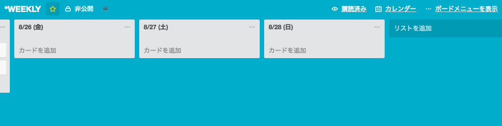

# trello-newweek.rb

Trelloで週次レビューしたい人用。

指定の日時で（デフォルトは今日から1週間）、指定のリストIDに空のリストを追加します。

## Install

Bundlerをインストールしておいてください。（rbenvを推奨）

    bundle install

## Usage

    ruby trello-newweek.rb  # 今日から一週間後までのリストを作成
    ruby trello-newweek.rb 2016-08-30  # 今日から2016/8/30までのリストを作成
    ruby trello-newweek.rb 2016-08-26 2016-08-26 # 2016/8/26から2016/8/30までのリストを作成

## Author

Twitter [@sky_y](https://twitter.com/sky_y)
